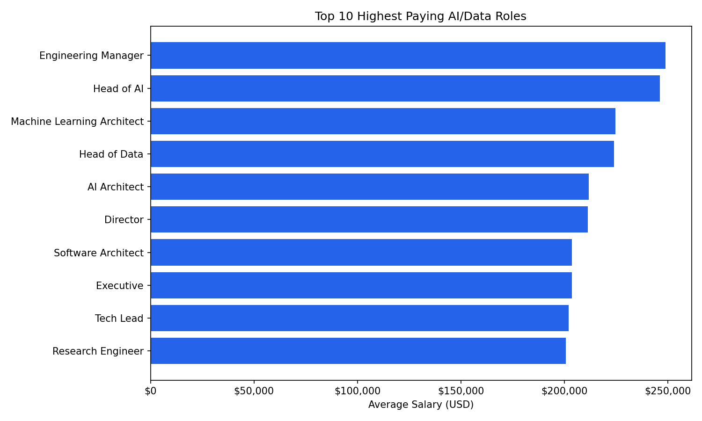
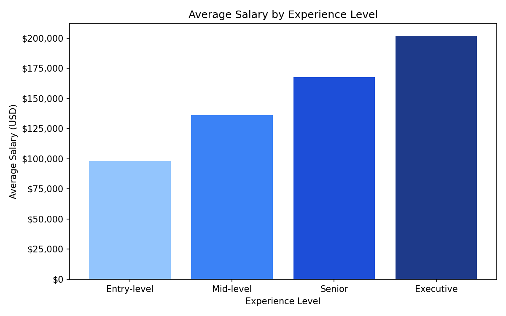
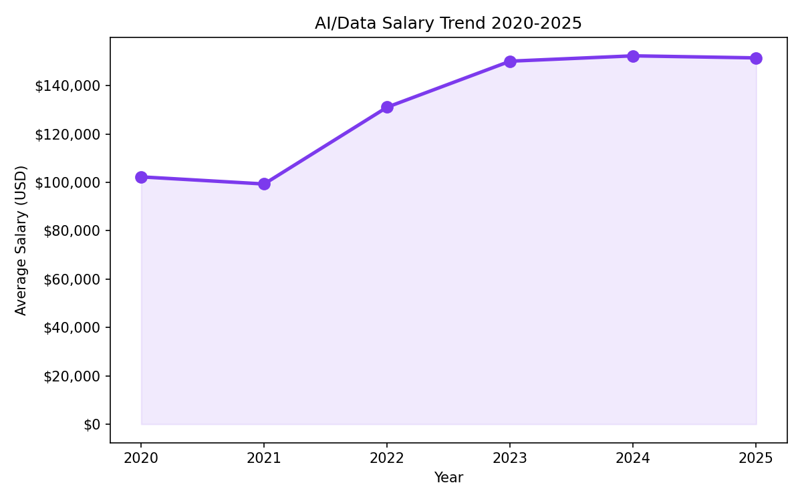

# Job Market Intelligence Pipeline

> End-to-end data pipeline analyzing 71,913 real AI/Data salary records (2020–2025)  
> Built with Python, Pandas, SQLite, SQL, Matplotlib, and Streamlit.

## What this project does

- **Ingests** raw CSV salary data into a normalized SQLite database using Python
- **Analyzes** the data with SQL queries to surface 5 key market insights  
- **Visualizes** findings as Matplotlib charts saved to the charts/ folder
- **Presents** everything in an interactive Streamlit dashboard with 3 tabs and live filters

## Key findings from the data

| Insight | Finding |
|---|---|
| Highest paying role | Engineering Manager at $248,975 avg |
| Entry-level avg salary | $98,017 — nearly $100K |
| Senior-level avg salary | $167,808 |
| Salary growth | $102K in 2020 → $152K in 2024 — 49% growth |
| Top country | USA with 60,147 records at $160K avg |
| Remote vs on-site | On-site ($152K) slightly higher than fully remote ($149K) |

## Project structure
job-market-intelligence/
├── app.py                  # Streamlit dashboard (3 tabs, interactive filters)
├── Data/
│   ├── salaries.csv        # Raw dataset — 71,913 records
│   ├── jobs.db             # SQLite database (generated by ingest.py)
│   └── src/
│       ├── ingest.py       # ETL pipeline — CSV → SQLite
│       └── analysis.py     # SQL analysis → 5 chart images
├── charts/                 # Generated chart PNG files
│   ├── top_paying_roles.png
│   ├── salary_by_experience.png
│   ├── salary_by_remote.png
│   ├── salary_trend.png
│   └── salary_by_country.png
└── README.md
## Tech stack

`Python` · `Pandas` · `SQLite` · `SQL` · `Matplotlib` · `Streamlit` · `Git` · `GitHub`

## How to run locally

```bash
pip install pandas matplotlib streamlit
python Data/src/ingest.py        # Build the SQLite database
python Data/src/analysis.py      # Run SQL analysis + generate charts
python -m streamlit run app.py   # Launch the dashboard
```

## Dashboard preview

### Salary Insights tab


### Salary by experience


### Salary trend 2020-2025
